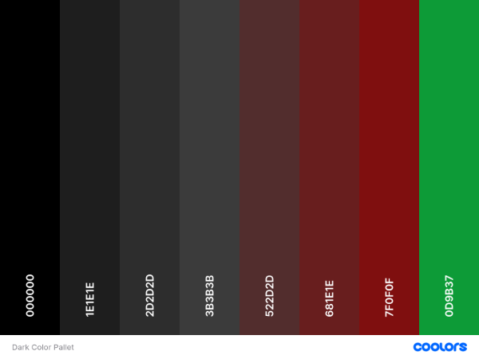
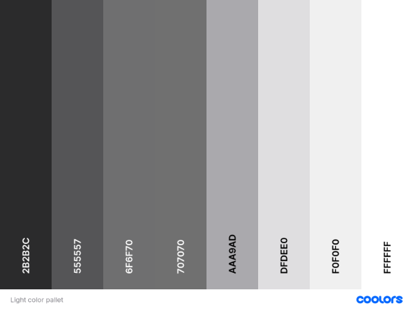
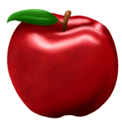
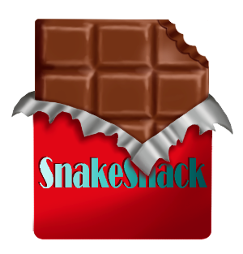
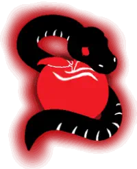
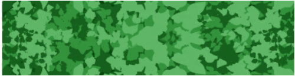
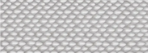

# Snake Snack

Are you ready to help the snake grow and get some food to eat? 
Snake Snack is based on the classic Snake Game that so many people around the world have grown up with.
It is for every person that wants either a hit of nostalgia or just a fun easy game to play. It is on a full on responsive webside with multiple options to either play the game or maybe you want to learn about the reason behind the website, or get in contact. So why not give it a try, and get lost in the game, try and beat your own high score while listening to a good song in the background.

## __User Stories__

  - ### First Time Visitor Goals

    - I want it to be easy to navigate the website.
    - I want to be able to play the game.
    - I will be able to learn about the creator and project.
    - I would be able to contact the creator with any inquiries.
    
## __Design__

### __Features__

- ### Existing Features

  - ### Favicon
    - All pages have a favicon in browser tab. The favicon used is of the logo for Snake Snack. [Favicon.io](https://favicon.io/) is used to create the favicon.

  - ### Navigation Bar
    - The navigation bar is showed on all pages. With only a slight difference on the game page where the page links aren't shown. It is fully responsive. It includes logo for snake snack, links to the diffrent pages - game page not included - social links, and a button for settings. 
    - It helps to create and easy navigations between the pages on the home page and easy acces to the settings button and social links.
    - On smaller screens the navigation menu moves inside a hambuger menu with the setting and logo staying outside.

  - ### Home Page
    - The home page introduces the game page. It has the hero-image that catches the eye of the visitor when they get on it, an image of a snake that is jumping out of the screen with the name Snake Snack behind it. 
    - The working buttons of rules and play to the right of the hero image. The rules buttons have a modal box pop op on the screen that explains the rules, how to play and what the different foods there are in the game. The play buttons open up directly into the game when clicked. 
    - The home page as well as the navigation bar is inclosed inside a card shape that fill out most of the page with the shadow border to give the effect.
    - On smaller screens the hero images moves to fill the whole width and the buttons move under it.

  - ### Footer
    - The footer is under the card effects with a copyright mark and disclaimer.
    
  - ### About Page
    - The about page have the header and two secions inside the page.
    - The first section describes what Snake Snack is and what it is based on. While the second section is about why this website was created.
    - It is fully responsive and the two section move under each other on smaller screens. 

  - ### Contact Page
    - The contact page is for the visitor that wants to get in contact with the creator.
    - The visitor can give feedback, send a message, or even write about collaborating. 
    - With two additional boxes to the right of the form the visitor will get information on respond time. As well as the email address and hours where the creator will be working.
    - In the form the visitor have to give there full name, there email address, choose a topic in the radio buttons, and give a little about what there inquiry is about. For  - To be able to push the send button all the boxes need to be answered as well as one radio button needs to be choosen. 
    - The send button then send the visitor to another page with a pop up window that needs to be clicked. Then they get a thank you that their message have been submited and with a link to go back to the home page.
    - On medium screens the two boxes jump beside each other above the form. On smaller screen they go on each other to keep it fully responsive.

  - ### Game Page
    - The game page has the game board in the middle of the screen inside the card shape. With the clickable controls on the right side and the pause button on the left corner right next to the game. Score board above the game.
    - The game board is in a light green color to simulat grass, and the border is made up from an images that looks like a bush is inclosing the game. 
    - The score board above the game shows the score number that goes up with the food that gets eaten. It shows the hightscore of the correct player. And what level they get to on the current play.
    - The clickable buttons to the right is fully responsive with hover effects that shows they are clickable. With different colors for each of the four control buttons.
    - On the game page the page links are gone and the logo is used to go back to the home page. 
    - On smaller screens the controls are moved under the game board and the game board fills out the width out the screen under the logo. The pause button stays on the left side but moves under the board instead of staying on the side. 

- ### Future Features
  - A future feature could be to have high score board that saves all high scores so visitors can try and beat each others score and get to the top.
  - Levels with opsticals of different bushes so the highest levels have a whole labyrient that the player have to go back and forth in to get the food.
  - Even more different kinds of food to go after.  

### __Typography and Color Scheme__

- ### Typography

- ### Color Scheme
  - The color scheme for Snake Snack is made with two different color scheme. 
  - The first is a more dark color scheme for the background and different element as well as a green for the game board. This was done to give a good contrast to the green board and the silver snake.
  - The second is a light color scheme which is used for the silver colours. For the text on the pages to give a contrast from the darker background. As well as most element like the rules modal, controller buttons, normal buttons, and scoreboard have snake scales with silvery color in the background.

 

 

### __Wireframes__

[The Home Page - Wireframe](./READMEimages/wireframes/HomeWireframes.png)

[The Settings - Wireframe](./READMEimages/wireframes/SettingsWireframes.png)

[The Rules Modal - Wireframe](./READMEimages/wireframes/RulesWireframes.png)

[The About Page - Wireframe](./READMEimages/wireframes/AboutWireframes.png)

[The Contact Page - Wireframe](./READMEimages/wireframes/ContactWireframes.png)

[The Game Page - Wireframe](./READMEimages/wireframes/GameWireframes.png)

### __Imagery__
  - All imagery on this website has been created specially for this page and game.

  
  
  
  
  
  

## __Testing__

## __Deployment__

## __Credits__
